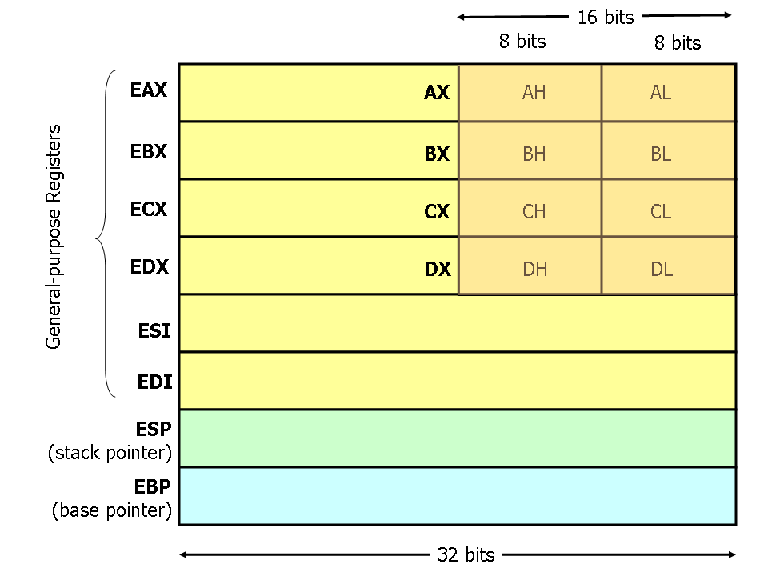

### Dissassembly

```bash
ndisasm boot.bin
```


#### Helpfull Links:
[x86 assembly Guide](https://www.cs.virginia.edu/~evans/cs216/guides/x86.html)

#### Sizes and meaning
- `DD`: 4 Bytes (32 Bits)
- `DW`: 2 Bytes (16 Bits)
- `DB`: 1 Byte  (8 Bits)

#### GDB
```bash
add-symbol-file build/kernelfull.o 0x0100000
break _start
target remote | qemu-system-x86_64 -hda bin/os.bin -S -gdb stdio
```